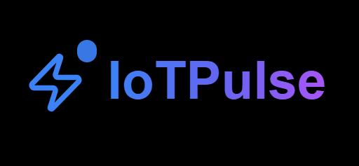
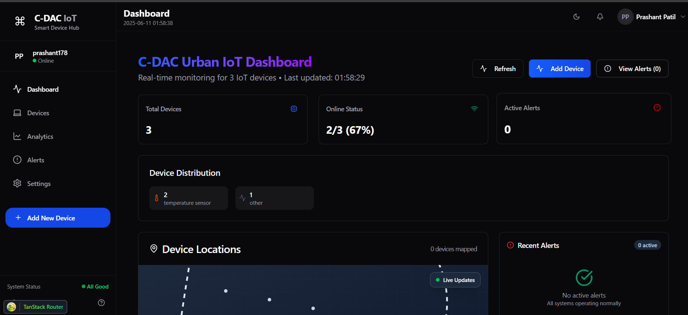
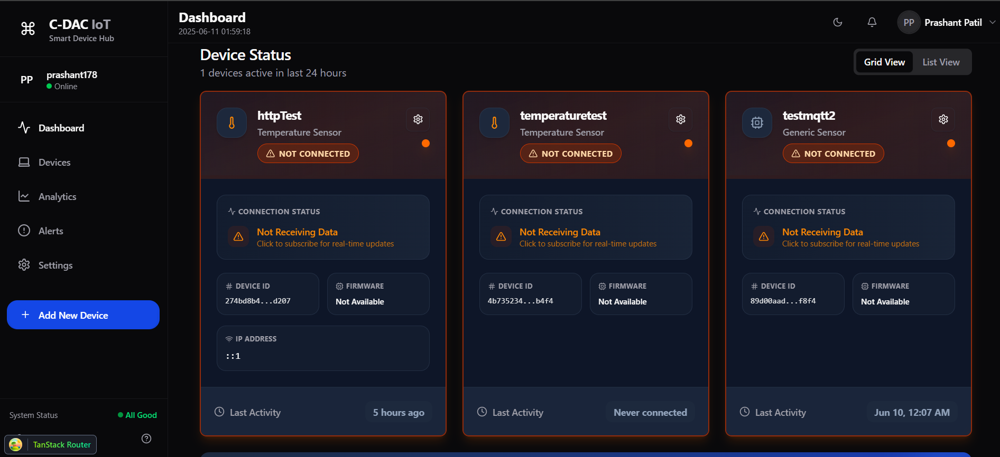
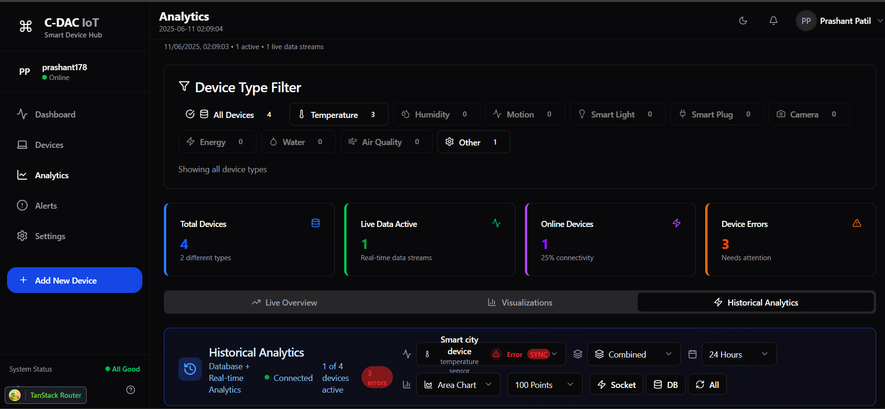
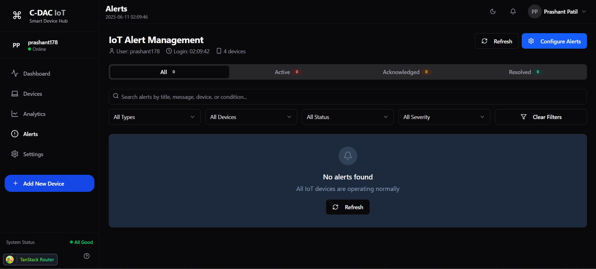
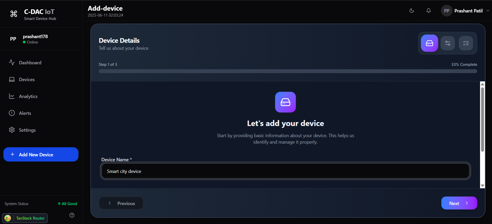
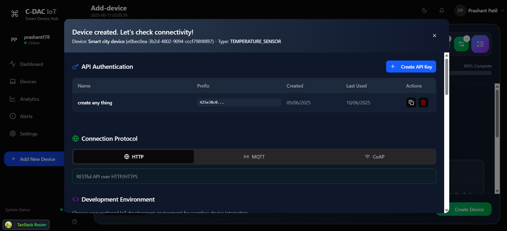

# IoTPulse

<div align="center">
  
  
  [](LICENSE)
  [](https://github.com/yourusername/iotpulse/releases)
  [](https://github.com/yourusername/iotpulse/stargazers)
  
  **A unified IoT platform for streamlined device management and data visualization**

  [Dashboard]
  [🚀 Landing Page and dashboard]([[https://iotpulse.example.com](https://v0-iotpulses-landing-page.vercel.app/)](https://v0-iotpulses-landing-page.vercel.app/)) 
  [Link](https://v0-iotpulses-landing-page.vercel.app/)
  [Documentation]
  [Tutorial]
</div>

---

## 🏠 Dashboard Overview

<div align="center">
  
  <p><em>Main dashboard showing real-time device monitoring and analytics</em></p>
</div>

IoTPulse is a unified IoT platform designed for businesses and developers to streamline IoT device management, data visualization, and analytics. It addresses the complexity and time-consuming nature of IoT data management and cloud backend development by providing a robust, secure, and customizable dashboard.


## 📋 Table of Contents

- [✨ Features](#-features)
- [🚀 Getting Started](#-getting-started)
- [💡 Usage](#-usage)
- [🔌 API Integration](#-api-integration)
- [🛠️ Development](#️-development)

## ✨ Features

### 🔗 Easy Device Onboarding


Industry-leading process to connect IoT devices using a simple link and token, with customizable template code for quick integration.

- One-click device registration
- Auto-generated connection templates
- Support for 50+ device types
- Bulk device import

<br clear="right"/>

### 📊 Real-Time Data Visualization


Live charts for connected and active devices, with comprehensive historical data analysis.

- Interactive real-time dashboards
- Historical trend analysis
- Customizable chart types
- Data export capabilities

<br clear="left"/>

### 🎨 Custom Dashboards
<div align="center">
  
  <p><em>Drag-and-drop dashboard builder with 20+ widget types</em></p>
</div>

Create tailored dashboards for specific use cases with our intuitive dashboard builder:
- **Drag & Drop Interface**: Build dashboards without coding
- **Widget Library**: 20+ pre-built widgets for different data types
- **Responsive Design**: Looks great on desktop, tablet, and mobile
- **Team Collaboration**: Share dashboards with team members

### 🚨 Smart Alerts & Notifications


Set up intelligent alerts for critical events to ensure timely responses.

- Real-time threshold monitoring
- Multi-channel notifications (Email, SMS, Slack)
- Custom alert rules and conditions
- Alert escalation workflows

<br clear="right"/>

### 🔐 Enterprise Security
<div align="center">
  <p><em>Bank-grade security with end-to-end encryption and compliance</em></p>
</div>

- **Authentication**: Multi-factor authentication, SSO integration
- **Authorization**: Role-based access control (RBAC)
- **Encryption**: AES-256 encryption for data at rest and in transit
- **Compliance**: SOC 2, GDPR, and HIPAA compliant

### 🎯 Developer-Friendly APIs


Use IoTPulse as a cloud backend to build custom IoT applications with our comprehensive API suite.

- RESTful APIs with OpenAPI specification
- GraphQL support for flexible queries
- SDK for popular programming languages
- Interactive API playground

<br clear="left"/>

## 🚀 Getting Started

### Prerequisites

<div align="center">
  
</div>

- A modern web browser (Chrome, Firefox, Edge, Safari)
- IoT device capable of MQTT or HTTP communication
- Basic knowledge of IoT protocols and APIs

### 🐳 Quick Installation with Docker

```bash
# Clone the repository
git clone https://github.com/yourusername/iotpulse.git
cd iotpulse

# Start with Docker Compose
docker-compose up -d

# Access the dashboard
open http://localhost:8080
```


## 💡 Usage

### 📱 Device Connection Wizard

<div align="center">
  
  <p><em>Step-by-step device connection process</em></p>
</div>

1. **Login** to your IoTPulse dashboard
2. **Navigate** to "Devices" → "Add Device"
3. **Select** your device type from our library
4. **Generate** unique connection credentials
5. **Copy** the auto-generated code to your device

### 📡 Data Publishing Methods

#### MQTT/HTTP Protocol


```javascript
const mqtt = require('mqtt');
const client = mqtt.connect('mqtt://iotpulse.example.com', {
  username: 'device-id',
  password: 'your-device-token'
});

client.publish('device/telemetry', JSON.stringify({
  temperature: 25.6,
  humidity: 60.2,
  timestamp: Date.now()
}));
```

#### HTTP REST API
```javascript
fetch('https://api.iotpulse.example.com/v1/data', {
  method: 'POST',
  headers: {
    'Authorization': 'Bearer your-device-token',
    'Content-Type': 'application/json'
  },
  body: JSON.stringify({
    temperature: 25.6,
    humidity: 60.2
  })
});
```

### 🎨 Dashboard Customization

<div align="center">
  <p><em>Customize your dashboard with drag-and-drop widgets</em></p>
</div>

## 🔌 API Integration

### 🔑 Authentication


Generate API keys from your dashboard's "API" section:

```bash
curl -H "Authorization: Bearer your-api-key" \
     https://api.iotpulse.example.com/v1/devices
```

### 📊 Data Retrieval

```javascript
// Get device data
const response = await fetch('/api/v1/devices/123/data?limit=100', {
  headers: { 'Authorization': 'Bearer your-api-key' }
});
const data = await response.json();
```


## 🛠️ Development

### 🏗️ Architecture Overview

<div align="center">
  
  <p><em>High-level system architecture and data flow</em></p>
</div>


